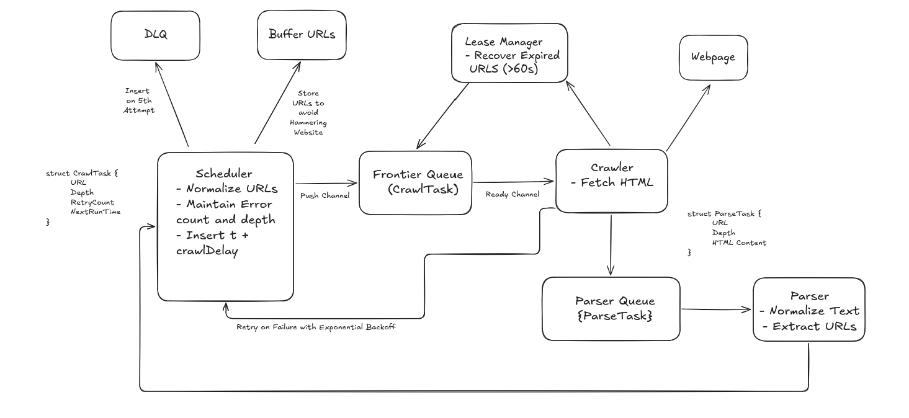

# Web Crawler V1

Welcome to **Web Crawler V1**. This repository contains a highly concurrent and modular web crawler implemented in Go.

## System Architecture (V1)

The architecture is designed to be scalable and fault-tolerant, separating the concerns of scheduling, crawling, and parsing into discrete components that communicate asynchronously.

<p align="center">
  
</p>

### Core Components

- **Scheduler**: The central brain of the crawler. It orchestrates the flow of `CrawlTasks` between the frontier, buffer, and worker pools.
- **Crawler Frontier**: Manages the queue of URLs waiting to be crawled. It ensures URLs are dispensed to the crawler workers efficiently.
- **Lease Manager**: Ensures that a single URL is not crawled concurrently by multiple workers. It manages short-lived "leases" on URLs and automatically recovers expired leases if a worker crashes or times out.
- **Parser Queue**: A dedicated queue that holds fetched web pages waiting to be processed by the parser workers.
- **Buffer (In-Memory)**: Temporarily buffers incoming URLs/tasks before they are routed to the frontier, smoothing out spikes in discovered links.
- **Dead Letter Queue (DLQ)**: Captures tasks that have failed multiple times (e.g., unreachable URLs or parsing errors), preventing them from clogging the main processing pipeline.

### Worker Pools

The system utilizes Go routines to manage two distinct pools of workers:

1. **Crawler Workers (5 concurrent)**: 
   - Pull URLs from the **Frontier**.
   - Acquire a lease from the **Lease Manager**.
   - Fetch the web page content.
   - Push the raw content to the **Parser Queue**.

2. **Parser Workers (10 concurrent)**:
   - Pull fetched content from the **Parser Queue**.
   - Parse the HTML to extract valuable data and discover new outgoing links.
   - Send newly discovered links back to the **Scheduler** for future crawling.

### High-Level Flow

1. The system is seeded with an initial URL (e.g., `https://example.com`).
2. The **Scheduler** receives the URL and places it into the **Frontier**.
3. A **Crawler Worker** picks up the URL, secures a lease, and downloads the page content.
4. The content is placed into the **Parser Queue**.
5. A **Parser Worker** picks up the content, extracts new URLs, and feeds them back to the **Scheduler**.
6. The process repeats, expanding the crawl based on defined depth or limits.

## Getting Started

To build and run the crawler:

```bash
# Build the binary
go build -o webcrawler ./cmd/main.go

# Run the crawler
./webcrawler
```
